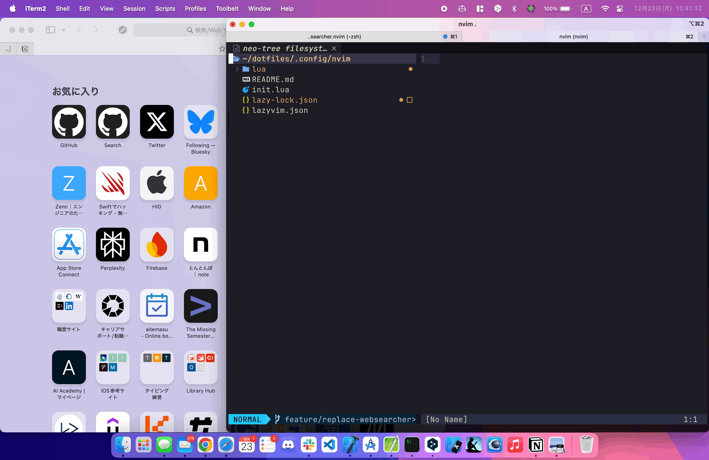
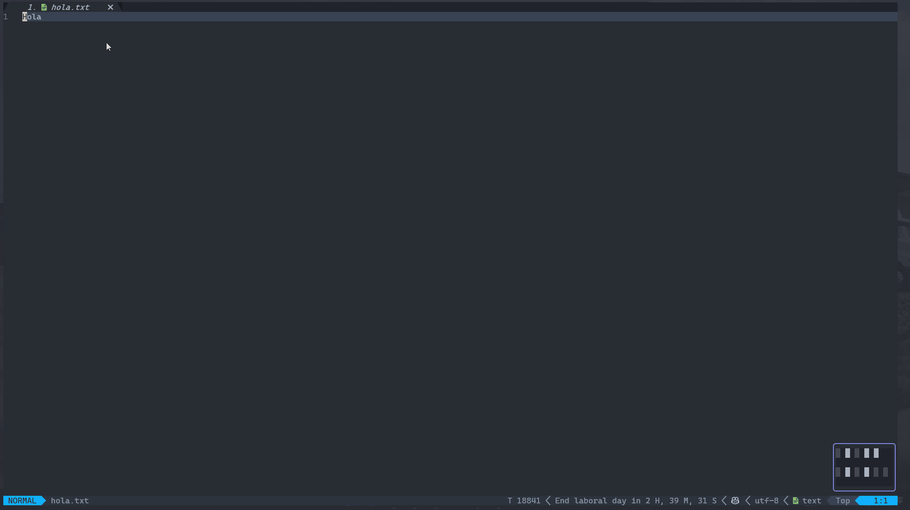
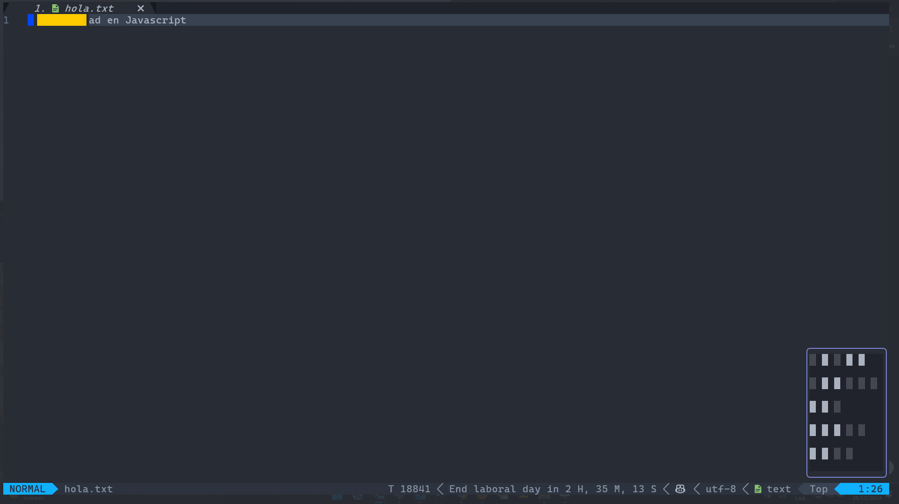
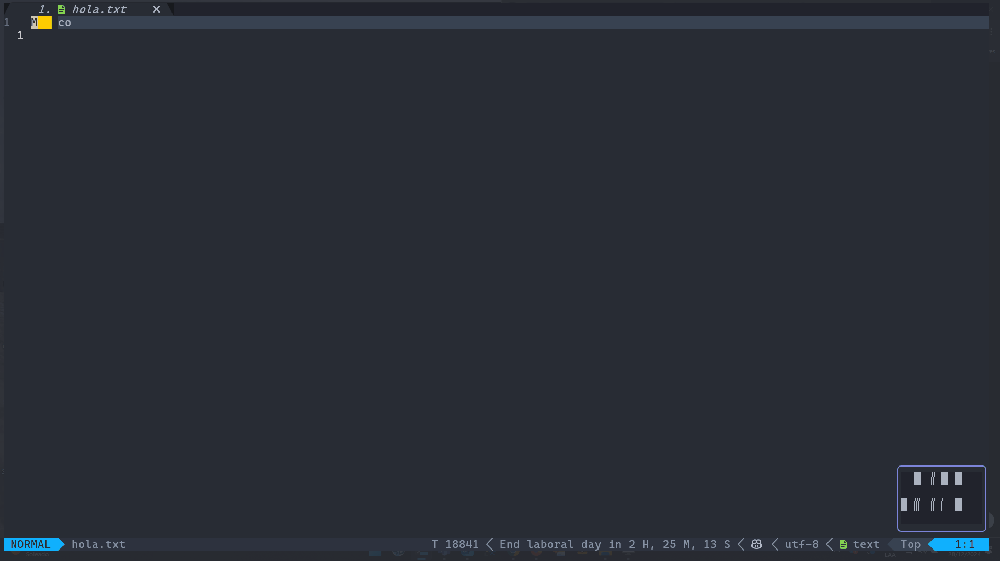

[](https://github.com/KaitoMuraoka/websearcher.nvim/actions/workflows/unit-test.yml)
# Websearcher.nvim

Websearcher is an extension to Neovim that enables web searches from Neovim.



## Getting Started

This section explains how to install Websearcher.

## Requirements

- macOS or Linux (or Windows)

Windows has not been tested.

### Installation

Lazy:

```lua
return {
	"KaitoMuraoka/websearcher.nvim"
}
```

Packer:

```lua
use "KaitoMuraoka/websearcher.nvim"
```

## Setup

Below are the default options for the setup function.

```lua
config = {
-- The shell command to use to open the URL.
-- As an empty string, it defaults to your OS defaults("open" for macOS, "xdg-open" for Linux)
open_cmd = "",

-- Specify search engine. Default is Google.
-- See the search_engine section for currently registered search engines
search_engine = "Google",

-- Use W3M in a floating window. Default is False
use_w3m = false,

-- Add custom search_engines.
-- See the search_engine section for currently registered search engines
search_engines = {},
},
```

### search_engine

- Google
- DuckDuckGo
- Bing
- Yahoo
- Baidu
- Yandex
- Ask
- Ecosia
- Phind
- Wikipedia
- Perplexity
- Brave

### Commands

- Websearch


- WebsearchOnEngine



- WebsearchOnEngines



In the Wikipedia engine you can select the language in which you want to perform the search.



### Keymaps

```lua
vim.api.nvim_set_keymap("v", "<leader>ss", ":lua require('websearcher').search_selected()<CR>", { noremap = true, silent = true })

vim.api.nvim_set_keymap("v", "<leader>se", ":lua require('websearcher').search_selected_with_engine()<CR>", { noremap = true, silent = true })

vim.api.nvim_set_keymap("v", "<leader>sm", ":lua require('websearcher').search_selected_multiple()<CR>", { noremap = true, silent = true })

```

## License

This plugin is License under the MIT license.
